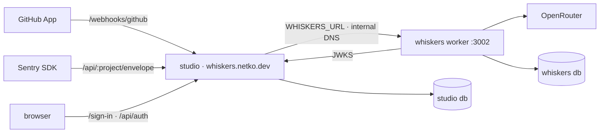

# CodeWhiskers

Code review, error tracking and logs for teams who'd rather ship. A GitHub App reviews every pull
request with an LLM of your choice (BYOK via OpenRouter), a Sentry-compatible endpoint ingests
production errors, and a small read API exposes the results. Brand and voice live in
[`docs/brand.md`](docs/brand.md).

## Topology

Two apps, one public host. **Studio** is the TanStack Start frontend plus the identity provider
(better-auth: magic link + JWT/JWKS). It owns `https://whiskers.netko.dev` and hands the whiskers
surfaces to the worker byte-for-byte, so GitHub's HMAC and Sentry's DSN checks still run where the
secrets live. **Whiskers** is a headless Bun/Elysia worker with no public host in production.



| | studio | whiskers |
| --- | --- | --- |
| Packages | `packages/studio/{domain,repository,service,api}`, `packages/configs/studio-config` | `packages/whiskers/{domain,repository,service,api}`, `packages/configs/whiskers-config` |
| Routes | `/sign-in`, `/api/auth/*`, `/api/health`; forwards `/webhooks/*`, `/api/:projectId/envelope\|store`, `/v1/*` | `/webhooks/github`, `/api/:projectId/envelope`, `/api/:projectId/store`, `/v1/{overview,issues,reviews}`, `/health` |
| Database | auth tables | reviews, findings, projects, issues, events |
| Dev URL | `https://studio.localhost` | `https://whiskers.localhost` |

Shared: `packages/shared/{cli,logger,ui,sandbox,typescript-config}`. The cat mark and expressions
ship from `@code-whiskers/ui/brand`. Disposable Docker sandboxes for the fix agent live in
`packages/shared/sandbox`.

## Run it

```bash
bun install
cp apps/studio/sample.env apps/studio/.env
cp apps/whiskers/sample.env apps/whiskers/.env      # add OPENROUTER_API_KEY + GitHub App creds

bun run repo docker:up --app studio && bun run repo db:migrate --app studio
bun run repo docker:up --app whiskers && bun run repo db:migrate --app whiskers

bun run repo dev --app whiskers   # https://whiskers.localhost
bun run repo dev --app studio     # https://studio.localhost (WHISKERS_URL points at the worker)
```

Dev servers run through [portless](https://github.com/vercel-labs/portless); `PORTLESS=0` falls
back to `localhost:3000` / `:3002`. Magic links log to the studio console until `USESEND_URL` + `USESEND_API_KEY`
are set.

## Reviews

Install the GitHub App on the organization with **Pull request**, **Issue comment** and **Pull
request review comment** events, webhook URL `https://whiskers.netko.dev/webhooks/github`. On every
PR the worker chunks the diff (14k chars, generated, vendored and binary files skipped), reviews
chunks in parallel on the `REVIEW_MODEL` (default `openai/gpt-6-luna`, medium reasoning) with
OpenRouter routed for throughput, and posts a review plus a check run. Mentioning the bot on a review
thread queues a fix. Cheap models are expected: malformed JSON is repaired, missing fields default,
and a failing chunk gets three jittered attempts (a timeout splits it) before it is skipped. Each
`review completed` log line carries the review's token tally.

## Error tracking

Point any Sentry SDK at `https://whiskers.netko.dev/api/<projectId>/envelope` with the project's
DSN key. Events are grouped into issues by fingerprint; `/v1/issues` and `/v1/overview` read them.

## Deploy

Coolify + Railpack, built from the repo root. `bun run repo build --app {app}` emits a
self-contained output plus `{out}/migrate/migrate.js`; `apps/{app}/railpack.json` ships only that.
Migrations run as the pre-deployment command. Studio serves the public host; whiskers has none and
is reached at `WHISKERS_URL=http://<whiskers app uuid>:3002` on the Coolify network. A first deploy
skips the pre-deployment command (no running container yet), so deploy twice.

Studio env: `BASE_URL`, `CORS`, `TRUSTED_ORIGINS`, `AUTH_SECRET`, `ENCRYPTION_KEY`, `DATABASE_URL`,
`WHISKERS_URL`, `GITHUB_CLIENT_ID`/`SECRET`, `INTERNAL_TOKEN`. Whiskers env: `DATABASE_URL`,
`WEB_BASE_URL`, `CORS`, `GITHUB_WEBHOOK_SECRET`, `GITHUB_APP_ID`, `GITHUB_APP_PRIVATE_KEY_B64`,
`GITHUB_BOT_HANDLE`, `OPENROUTER_API_KEY`, `REVIEW_MODEL`, `INTERNAL_TOKEN`.

## Verify

```bash
bun run check-types && bun run fmt-lint && bun run test
```
