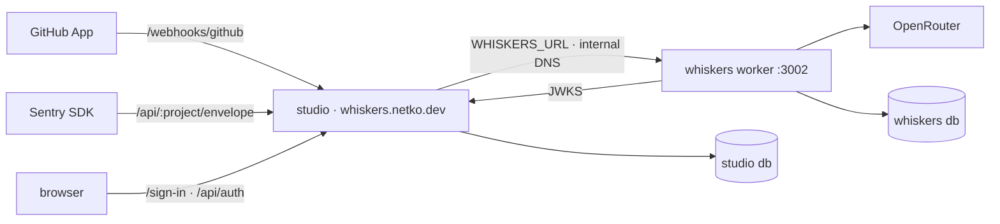

# CodeWhiskers

Code review, error tracking and logs for teams who'd rather ship. A GitHub App reviews every pull
request with an LLM of your choice (BYOK via OpenRouter), a Sentry-compatible endpoint ingests
production errors, and a small read API exposes the results. Brand and voice live in
[`docs/brand.md`](docs/brand.md).

## Topology

Two apps, one public host. **Studio** is the TanStack Start frontend plus the identity provider
(better-auth: magic link + JWT/JWKS). It owns `https://whiskers.netko.dev` and hands the whiskers
surfaces to the worker byte-for-byte, so GitHub's HMAC and Sentry's DSN checks still run where the
secrets live. **Whiskers** is a headless Bun/Elysia worker with no public host in production.


```mermaid
flowchart LR
  GH[GitHub App] -->|/webhooks/github| S[studio · whiskers.netko.dev]
  SDK[Sentry SDK] -->|/api/:project/envelope| S
  U[browser] -->|/sign-in · /api/auth| S
  S -->|WHISKERS_URL · internal DNS| W[whiskers worker :3002]
  W --> OR[OpenRouter]
  W --> DBW[(whiskers db)]
  S --> DBS[(studio db)]
  W -->|JWKS| S
```

| | studio | whiskers |
| --- | --- | --- |
| Packages | `packages/studio/{domain,repository,service,api}`, `packages/configs/studio-config` | `packages/whiskers/{domain,repository,service,api}`, `packages/configs/whiskers-config` |
| Routes | `/sign-in`, `/api/auth/*`, `/api/health`; forwards `/webhooks/*`, `/api/:projectId/envelope\|store\|deploys`, `/v1/*` | `/webhooks/github`, `/api/:projectId/envelope`, `/api/:projectId/store`, `/api/:projectId/deploys`, `/v1/{overview,issues,reviews,projects,releases}`, `/internal/*` (studio only), `/health` |
| Database | auth tables | reviews, findings, projects, issues, events |
| Dev URL | `https://studio.localhost` | `https://whiskers.localhost` |

Shared: `packages/shared/{cli,logger,ui,sandbox,typescript-config}`. The cat mark and expressions
ship from `@code-whiskers/ui/brand`. Disposable Docker sandboxes for the fix agent live in
`packages/shared/sandbox`.

## Run it

```bash
bun install
cp apps/studio/sample.env apps/studio/.env
cp apps/whiskers/sample.env apps/whiskers/.env      # add OPENROUTER_API_KEY + GitHub App creds

bun run repo docker:up --app studio && bun run repo db:migrate --app studio
bun run repo docker:up --app whiskers && bun run repo db:migrate --app whiskers

bun run repo dev --app whiskers   # https://whiskers.localhost
bun run repo dev --app studio     # https://studio.localhost (WHISKERS_URL points at the worker)
```

Dev servers run through [portless](https://github.com/vercel-labs/portless); `PORTLESS=0` falls
back to `localhost:3000` / `:3002`. Magic links log to the studio console until `USESEND_URL` + `USESEND_API_KEY`
are set.

## Reviews

Install the GitHub App on the organization with **Pull request**, **Issue comment** and **Pull
request review comment** events, webhook URL `https://whiskers.netko.dev/webhooks/github`. On every
PR the worker chunks the diff (14k chars, generated, vendored and binary files skipped), reviews
chunks in parallel on the `REVIEW_MODEL` (default `openai/gpt-6-luna`, medium reasoning) with
OpenRouter routed for throughput, and posts a review plus a check run. Mentioning the bot on a review
thread queues a fix. Cheap models are expected: malformed JSON is repaired, missing fields default,
and a failing chunk gets three jittered attempts (a timeout splits it) before it is skipped. Each
`review completed` log line carries the review's token tally.

## Error tracking

Point any Sentry SDK at `https://whiskers.netko.dev/api/<projectId>/envelope` with one of the
project's enabled client keys as `sentry_key` (the DSN does this). Events are grouped into issues by fingerprint (the SDK's, else the thrown exception plus
its top in-app frame); `/v1/issues` and `/v1/overview` read them. Bodies may be gzip, deflate or br,
up to 1 MiB on the wire and 20 MiB decoded (413 past that); a retried `event_id` is stored once.

An issue is **unresolved**, **resolved** (now, or in the next release) or **archived** (forever,
until a time, or until N more events or users). Studio records the decision
(`POST /api/triage/issues/lifecycle`) and writes it through to whiskers, which keeps a mirror so
ingest can act on it: a resolved issue that recurs regresses, an archive whose condition runs out
ends, and whiskers tells studio (`POST /api/internal/issues/transition`). `/v1/issues` pages,
filters and sorts server-side and carries `new` / `regressed` / `spiking` badges and a 14-day trend;
`/v1/issues/:id`, `/v1/issues/:id/events` and `/v1/issues/:id/events/:eventId` read one issue.

## Deploy

Coolify + Railpack, built from the repo root. `bun run repo build --app {app}` emits a
self-contained output plus `{out}/migrate/migrate.js`; `apps/{app}/railpack.json` ships only that.
The start command migrates inside the new container, then starts the server — leave Coolify's
pre-deployment command empty (it runs in the *previous* container, with the previous migrations).
Production refuses to boot without its required env. Studio serves the public host; whiskers has
none and is reached at `WHISKERS_URL=http://<whiskers app uuid>:3002` on the Coolify network.

Studio env: `BASE_URL`, `CORS`, `TRUSTED_ORIGINS`, `AUTH_SECRET`, `ENCRYPTION_KEY` (any length;
encrypts webhook URLs), `DATABASE_URL`, `WHISKERS_URL`, `GITHUB_CLIENT_ID`/`SECRET`, `GITHUB_APP_SLUG`
(default `code-whiskers`), `INTERNAL_TOKEN`. Whiskers env: `DATABASE_URL`, `WEB_BASE_URL`, `CORS`,
`GITHUB_WEBHOOK_SECRET`, `GITHUB_APP_ID`, `GITHUB_APP_PRIVATE_KEY_B64`, `GITHUB_BOT_HANDLE`,
`OPENROUTER_API_KEY`, `REVIEW_MODEL`, `INTERNAL_TOKEN` (also switches on alert evaluation),
`TELEMETRY_RETENTION_DAYS` (default 7), `ERROR_EVENT_RETENTION_DAYS` (default 90).

code-whiskers reports its own errors to a code-whiskers project when `SENTRY_DSN` is set (both apps;
studio's browser also needs `VITE_SENTRY_DSN` as a build variable): see `docs/observability.md`.

### On a pull request

Every push is reviewed once: the first push reads the whole PR, later pushes only what changed
since the last reviewed commit (a force-push or `@code-whiskers review` reads it all again). The
PR description counts as intended design. When the head's typecheck-like CI check (`type`,
`tsc`, `check-types`, `quality`, `build`) is green, "callers not updated / missing / does not
compile" findings are dropped. Once a commit reviews clean, the reviewer dismisses its own
earlier "changes requested". Generator templates (`*.hbs`, `turbo/generators/templates/**`) are
not reviewed as text. The reviewer reads the repository's `CLAUDE.md` and `AGENTS.md` (the
root one and any above the changed files, plus what they `@import`) and flags violations as
`convention` findings. A failed review retries twice (after 30 s and 2 min) before it posts the
failure; an alert rule of kind "A review fails" delivers that to Slack, Discord or a webhook.

Mention `@code-whiskers` in a PR comment or on one of its review threads (repo insiders only):

| Mention | Does |
| --- | --- |
| `@code-whiskers fix` | pushes the change for the thread, or proposes one for the PR |
| `@code-whiskers review` | reviews the current head again, even if it was reviewed |
| `@code-whiskers ignore [why]` | on a review thread: dismisses the finding for the whole repo and resolves the thread |
| `@code-whiskers <question>` | answers from the finding, the file at head or the diff |

Or skip typing — react on one of its review comments (checked every minute, insiders only):

| React | Same as |
| --- | --- |
| 👎 | `@code-whiskers ignore`, silently — the thread resolves, no reply |
| 🚀 | `@code-whiskers fix` |
| 😕 | `@code-whiskers why?` |

A reply, a 👎 or a resolved thread counts as an answer: that finding is not raised again on the PR.

### Sending data in

- **Errors** — **New project** in the console (`/console/projects/new`): pick a platform, get the
  install snippet with the DSN filled in, and watch the first event land (or press **Send test
  event**, which ingests a synthetic error server-side, no SDK needed). A project has any number of
  client keys (`/console/projects/<id>`: add, disable, delete — never the last enabled one); every
  enabled key is a valid DSN.
- **Releases and deploys** — events carry `release` from `Sentry.init`, and each new one becomes a
  release. Report deploys from CI or Coolify with the same client key (one line, also on the
  project's settings page):

  ```bash
  curl -fsS -X POST https://<host>/api/<projectId>/deploys -H "Authorization: DSN <client key>" -H "Content-Type: application/json" -d "{\"version\":\"$SOURCE_COMMIT\",\"environment\":\"production\",\"commitSha\":\"$SOURCE_COMMIT\"}"
  ```

  Optional fields: `url`, `name`, `repository` (must match the project's linked one), `deployedAt`.
  With a repository and a sha, whiskers reads the commits since the previous release through the
  GitHub App, links each to its PR and review, and flags suspect commits on issues.
- **Logs and traces** — OTLP over HTTP with JSON bodies: point an exporter at
  `https://<host>/otlp` with `OTEL_EXPORTER_OTLP_PROTOCOL=http/json` and the header
  `Authorization: Bearer <an enabled client key>`. Protobuf is refused with a 415 that says so.
- **Reading** — `/v1/*` answers a signed-in browser or `Authorization: Bearer cw_…` from an API key
  (read-only).

## Verify

```bash
bun run check-types && bun run fmt-lint && bun run test
```
